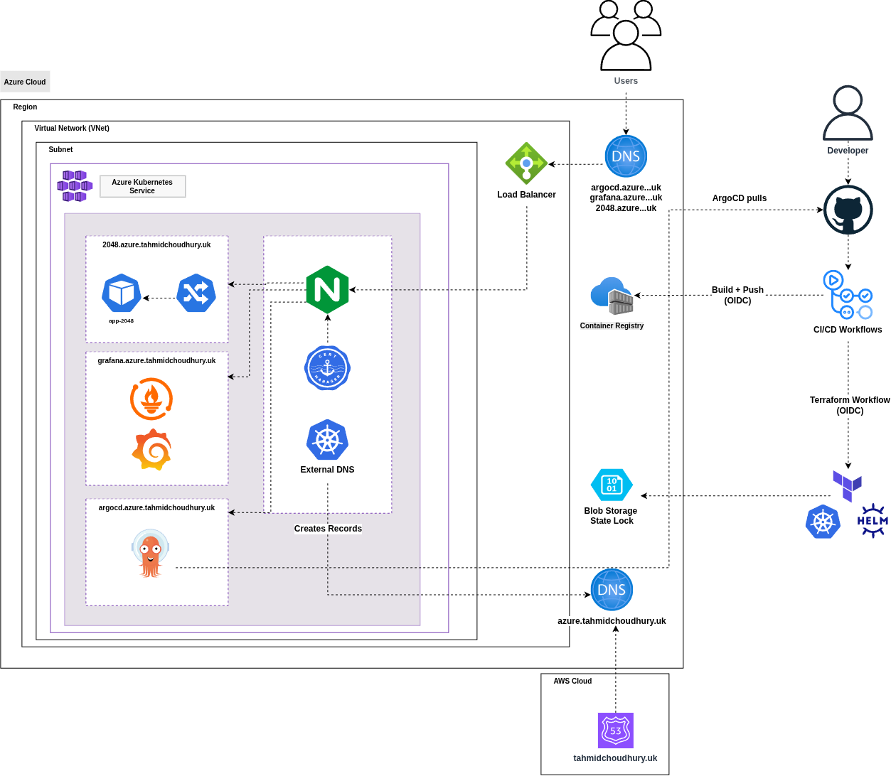
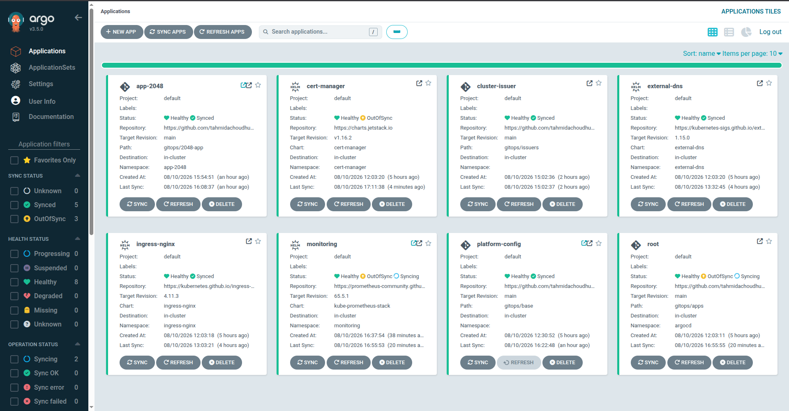
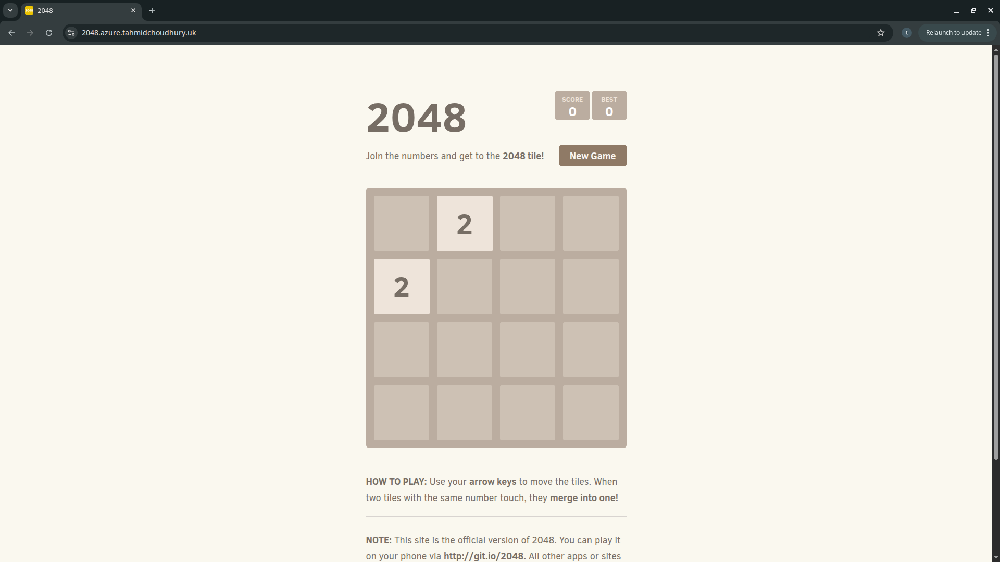
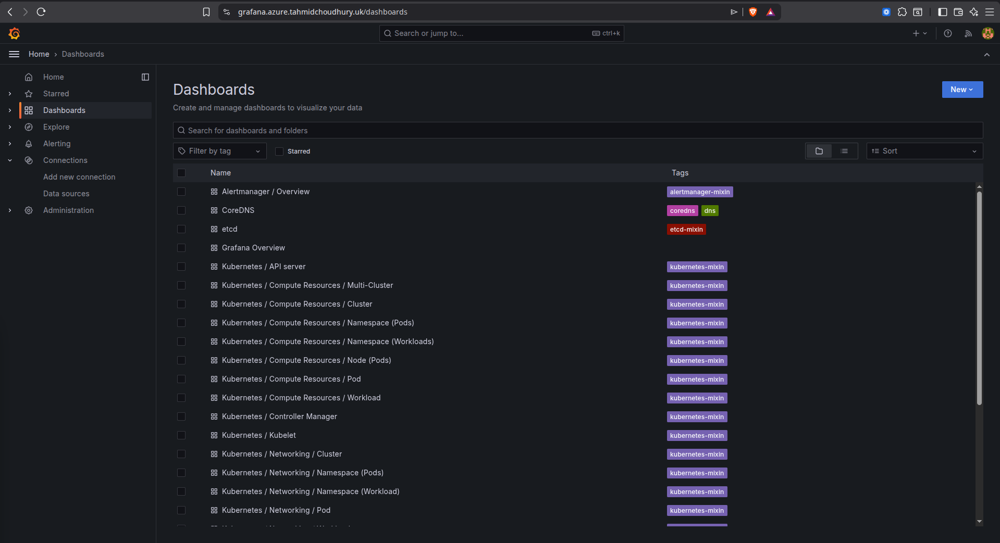
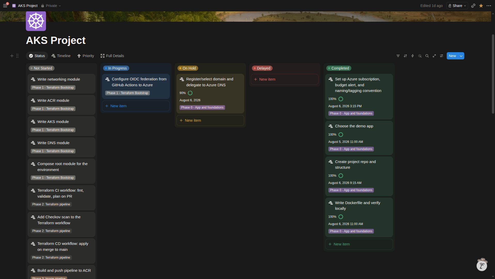
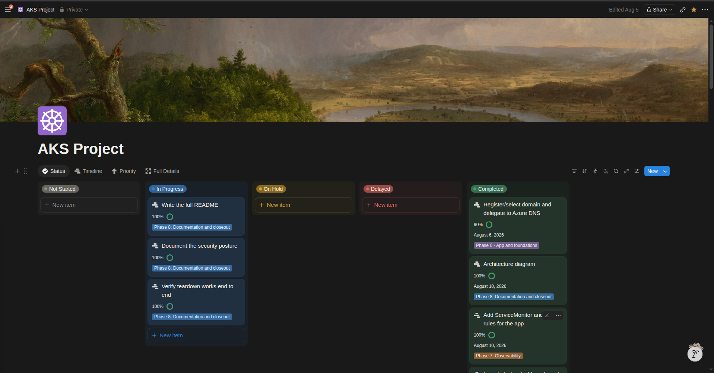
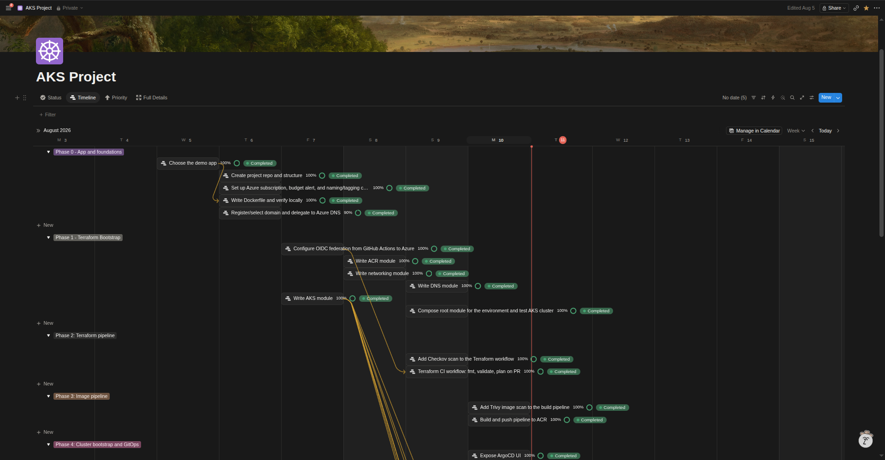

# Azure AKS Platform

A production-style Kubernetes platform on Azure, provisioned entirely from code. Terraform builds the infrastructure, ArgoCD reconciles everything running inside the cluster, and a containerised application is served over HTTPS on a custom domain with automatic DNS and certificate management.

**Live:** [2048.azure.tahmidchoudhury.uk](https://2048.azure.tahmidchoudhury.uk)

---

## Contents

- [Architecture](#architecture)
- [How it works](#how-it-works)
- [Repository layout](#repository-layout)
- [Design decisions](#design-decisions)
- [Security posture](#security-posture)
- [Proof of work](#proof-of-work)
- [Running it yourself](#running-it-yourself)
- [Tools](#tools)
- [Author](#author)

---

## Architecture



| Layer            | Components                                                          |
| ---------------- | ------------------------------------------------------------------- |
| Infrastructure   | AKS 1.35, Virtual Network, NSG, Azure Container Registry, Azure DNS |
| Cluster platform | ArgoCD, ingress-nginx, cert-manager, ExternalDNS                    |
| Observability    | Grafana, Prometheus, kube-state-metrics, node-exporter              |
| CI/CD            | GitHub Actions with OIDC federation, Checkov, Trivy                 |
| Networking       | Azure CNI Overlay with Cilium dataplane, Standard Load Balancer     |

---

## How it works

1. Code is pushed to GitHub. A workflow builds the image, scans it with Trivy, and pushes to ACR tagged with the commit SHA.
2. The same workflow commits the new tag back into the Kubernetes manifest in this repo.
3. ArgoCD, running inside the cluster, notices the change and applies it. CI never touches the cluster.
4. The application's Ingress triggers two things automatically: ExternalDNS writes an A record into Azure DNS, and cert-manager requests a certificate from Let's Encrypt via an HTTP-01 challenge.
5. Traffic arrives at an Azure Standard Load Balancer, routes through ingress-nginx, and reaches the pod over HTTPS.

Terraform runs in its own pipeline: `fmt`, `validate` and `plan` on pull requests with Checkov scanning, then `apply` on merge behind a manual approval gate.

---

## Repository layout

```
infra/
  bootstrap/    ACR and the ExternalDNS managed identity — long-lived
  platform/     VNet, NSG, AKS, federated credentials — destroyed and rebuilt freely
  argocd/       ArgoCD Helm release — the only cluster component Terraform manages
gitops/
  apps/         ArgoCD Application manifests (app-of-apps children)
  base/         Namespaces, PriorityClasses, ConfigMaps
  issuers/      Let's Encrypt ClusterIssuers
  2048-app/     Application manifests
docs/           Architecture diagram and decision notes
```

Three Terraform stacks with separate state keys, split by lifecycle rather than by resource type. Anything that must survive a teardown lives in `bootstrap`; everything else is disposable.

---

## Design decisions

**Terraform installs ArgoCD, ArgoCD installs everything else.** Terraform converges when you run it; ArgoCD converges continuously. Cluster workloads self-heal from drift, infrastructure does not need to. The one exception is ArgoCD itself, which cannot bootstrap itself and lives in Terraform state.

**No public subnet.** The project brief asked for "private subnets for the cluster and public subnets for load balancing", which is AWS thinking. An Azure Standard Load Balancer is not deployed into a subnet at all — it has a public IP and backend pool references, nothing more. Azure also has no Internet Gateway, because every subnet has system routes to the internet by default. Subnets here are named by function rather than by a public/private distinction that does not exist.

**Single node pool.** Workload isolation is handled with PriorityClasses, ResourceQuotas and LimitRanges rather than tainting a system pool. The taint only addresses one failure mode; eviction ordering is governed by QoS class and priority regardless. This halves compute cost on a cluster that is destroyed nightly.

**Azure CNI Overlay.** In flat mode every pod consumes a VNet address and AKS reserves the full per-node pod allocation up front, so a small subnet fills quickly and the cluster silently stops scaling. Overlay assigns pod IPs from a separate logical range, so the subnet only needs one address per node. It is also required for the Cilium dataplane.

**The ExternalDNS identity lives in the bootstrap stack.** It started in the platform stack, which meant every teardown produced a new client ID and left a stale value in a manifest ArgoCD was still applying. Identities referenced from Git belong in the long-lived stack.

---

## Security posture

**No stored credentials.** GitHub Actions authenticates to Azure via OIDC federated identity. There are no client secrets, service principal passwords, or storage account keys anywhere in the repository or in GitHub secrets.

**Two workload identities, least privilege each.** The Terraform pipeline holds Contributor and Role Based Access Control Administrator scoped to specific resource groups. The image build pipeline holds only `AcrPush` on the registry. A compromised build cannot modify infrastructure.

**Workload identity inside the cluster.** ExternalDNS authenticates to Azure DNS by exchanging its Kubernetes service account token for an Entra ID token, via a federated credential bound to the cluster's OIDC issuer and the exact service account subject. No secret exists in the chain to leak.

**Terraform state.** Held in a storage account with public access disabled, shared key access disabled, Entra ID authentication only, blob versioning and soft delete enabled. Locking uses native blob leases — Azure needs no DynamoDB equivalent.

**Scanning.** Checkov on Terraform and Trivy on container images. Every suppression is inline with a stated reason. Eight ACR findings are skipped because they require the Premium SKU (private networking, zone redundancy, retention policies, geo-replication, content trust, dedicated data endpoints, quarantine) and one because image scanning is covered by Trivy rather than Defender for Containers.

**Image hardening.** Alpine build, non-root user, dropped capabilities, no privilege escalation, 20MB final image.

---

## Proof of work



> ArgoCD showing all Applications synced and healthy



> The application served over HTTPS with a valid Let's Encrypt certificate



> Grafana on its own hostname

### Delivery

The project was broken into 35 tickets across eight phases and tracked on a kanban board, sequenced by dependency rather than by component. Foundations and identity federation came first because they block everything downstream; documentation came last.





Some ordering was revised mid-project. The application choice and Dockerfile moved to the top once it became clear the image was needed before the registry pipeline could be tested end to end, and the ArgoCD UI ticket was deferred behind the ingress and TLS work it depended on.

---

## Running it yourself

**Prerequisites**

Azure subscription on pay-as-you-go. A free trial blocks every VM family for AKS, and the failure surfaces as an unhelpful `BadRequest` at cluster creation rather than as a quota error.

Register the resource providers. Azure gates each service per subscription, and Terraform does not auto-register the way the portal does:

```bash
for ns in Microsoft.ContainerService Microsoft.ContainerRegistry Microsoft.Network \
          Microsoft.Compute Microsoft.Storage Microsoft.ManagedIdentity Microsoft.Authorization; do
  az provider register --namespace "$ns"
done
```

Check which VM sizes your region actually offers before setting `node_vm_size`. Availability varies by region and generation, and the authoritative list appears in the error message if you get it wrong.

**Manual bootstrap**

Three things are created by hand because Terraform cannot create its own backend and because they must survive a teardown: the state storage account, the DNS zone, and the NS delegation from the parent domain.

**Deploy**

```bash
make init
make up           # platform, then ArgoCD, then kubeconfig
make down         # destroys the platform stack only
```

After the first bootstrap apply, copy `external_dns_client_id` from the outputs into the ExternalDNS service account annotation in `gitops/apps/external-dns.yml`.

---

## Tools

Terraform · Azure Kubernetes Service · Azure Container Registry · Azure DNS · Entra ID Workload Identity · ArgoCD · Helm · ingress-nginx · cert-manager · ExternalDNS · Grafana · Cilium · GitHub Actions · Checkov · Trivy · Docker

---

## Author

**Tahmid Choudhury** - DevOps Engineer

---

### **Connect**

<p align="center">
  <a href="https://www.linkedin.com/in/t-a-choudhury/" target="_blank" rel="noopener noreferrer">
    
  </a>
  <a href="https://www.tahmidchoudhury.uk" target="_blank" rel="noopener noreferrer">
    
  </a>
  <a href="https://github.com/tahmidachoudhury" target="_blank" rel="noopener noreferrer">
    
  </a>
</p>
